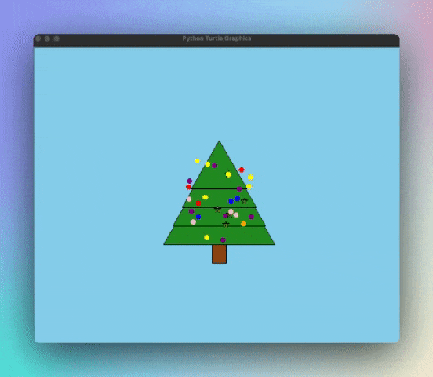

# 🎄 Christmas Tree Drawing 🎄

This is a fun and festive Python script that uses the `turtle` module to draw a beautiful Christmas tree. 🎄🐢🎨

## 📝 Description

The program draws a Christmas tree with different sections, decorations, and stars. The decorations glitter with different colors, creating a festive atmosphere. The tree is drawn on a sky-blue background, and the drawing is done using the `turtle` module in Python.



## 🚀 Features

- Draws a Christmas tree with four sections.
- Decorates the tree with 25 balls of different colors.
- Adds five stars to the tree.
- The decorations glitter, changing colors every 500 milliseconds.
- The tree is drawn on a sky-blue background.

## 🛠️ Setup

Run the program:

```shell
python christmas_tree.py
```

## 📜 License

MIT license.

## 🤝 Contributing

Any more features are welcome! ⭐️
